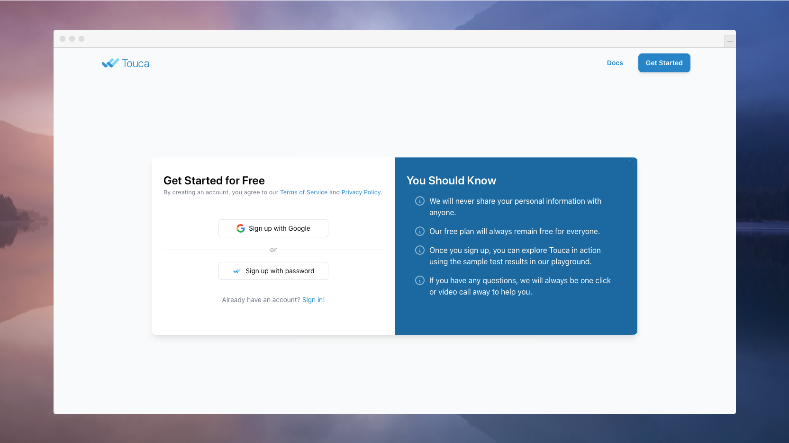
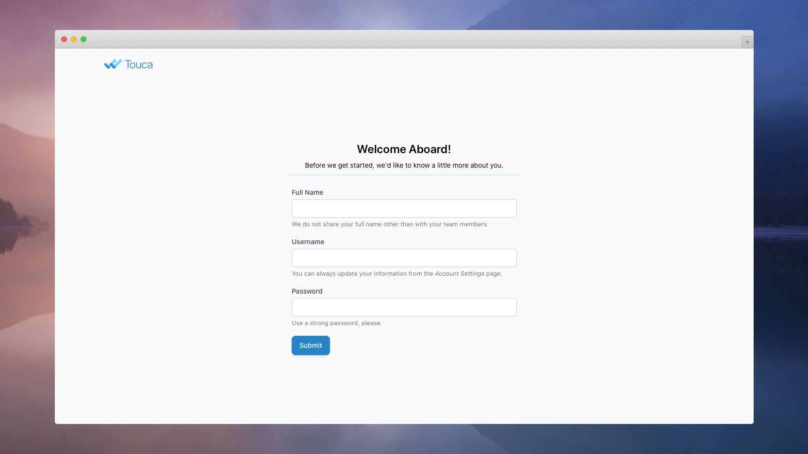
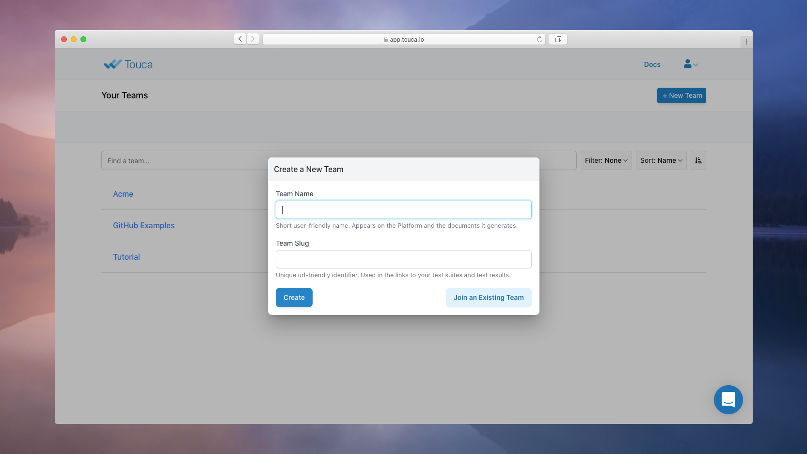
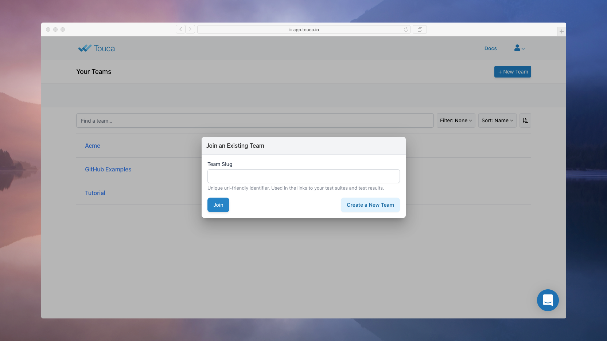
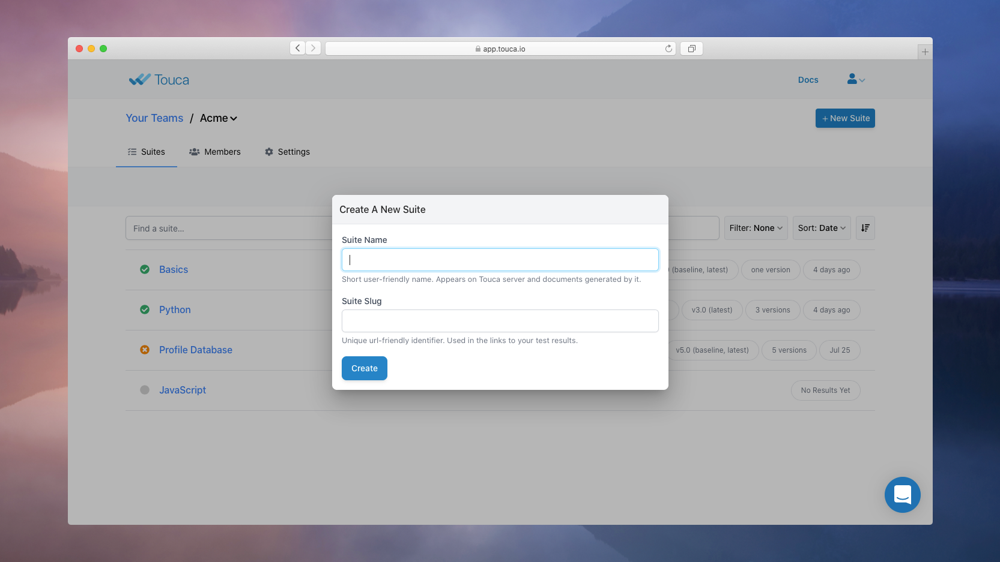
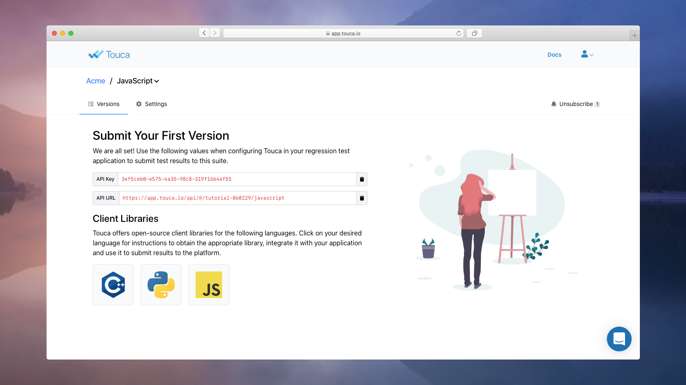

# Setting Up Your Account

This document shows you how to create an account on the Touca server to submit
new results or view results submitted by your team. While you can self-host the
Touca server, we will use a cloud-hosted version that is available at
[app.touca.io](https://app.touca.io).

To create an account using the "Sign up with Password" button, you only need
providing your email address. We will send an email address with a link that you
can use to set your fullname, username, and password.

In addition to using a password, Touca Cloud allows you to create an account
using your Google Account. We will reuse the name and email address of your
Google account, simplifying the overall onboarding process.

## Create a New Team

You will notice that Touca has automatically created a Team for you and
populated them with sample test results that will help you explore Touca in
action. If you are self-hosting Touca, your platform administrator may have
disabled this feature.

We encourage you to explore the sample test results in the "Tutorial" team, but
you can create your own team, as well. Each user account on Touca can be a
member or the owner of multiple teams. To create a team, simply click on the
"New Team" button on the top right corner of the screen.

Creating a team requires choosing a "slug" and a "name". We recommend that you
choose descriptive values for both. You will share them with those you invite to
your team. Other users who want to join your team would need to know your team
slug to send requests.

- A team slug can be any string no less than 3 and no more than 32 characters in
  length. It can mix numeric digits and ASCII letters with hyphens in between.
  `acme-proj-2` is a valid slug.
- A team name can be any string up to 32 characters in length.

## Join an Existing Team

If your team members have already created an team, you can ask to join them by
clicking the "Join an Existing Team" button and entering the slug for the team
you want to join. This will send a Join Request that the team admins or the team
owner can approve or decline.

## Create a Suite

You can create any number of suites within a team. Each suite can correspond to
a workflow in your product and can host test results submitted for different
versions of that workflow. Similar to creating a team, creating a suite requires
a slug and a name. Suites created within a team can be accessed by all members
of that team.

Upon creation of a new suite, the Touca Server provides you with an API Key and
an API URL. You can use this information to submit your test results for any
given version of your software workflow. We will show you how to do so in the
next document.

