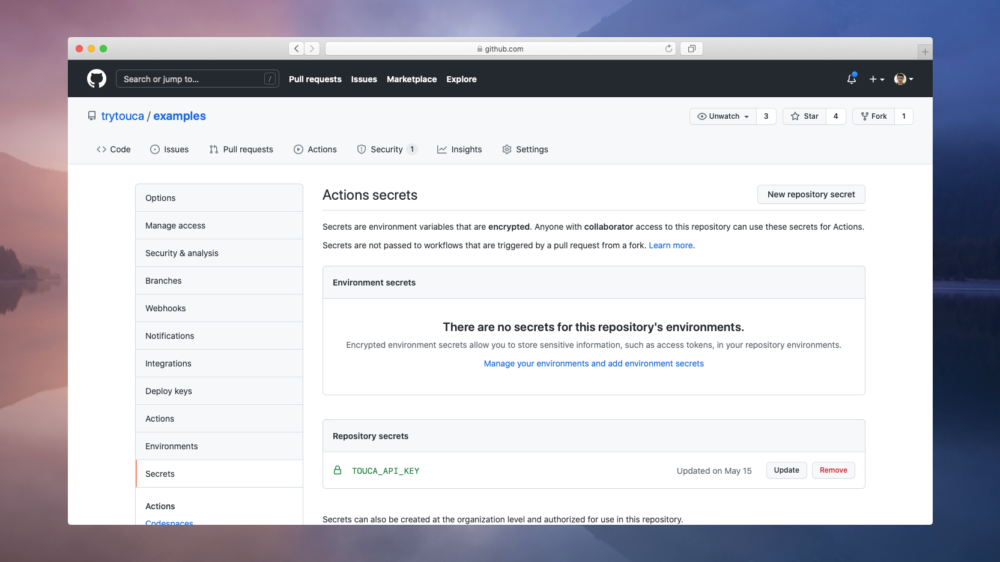

# Automate Your Tests

So far we learned how to test our workflows with Touca client libraries, how to
run those tests to submit information about the behavior and performance of our
workflows to the Touca server, and how to use the Touca server to visualize the
differences and receive reports about how our software changes over time. In
this document, we will learn how to automate the execution of our Touca tests,
to continuously receive feedback about incremental changes to our software.

Automating Touca tests is _usually_ very straightforward. "_usually_" because
this process depends on your software testing requirements and the complexity of
your build and delivery pipelines. Since Touca is designed for testing
real-world software applications, we strive to provide necessary tooling to
facilitate continuous testing of these systems.

There are two main approaches to test automation: We can run Touca tests as part
of our Continuous Integration (CI) pipeline or we can leverage a dedicated test
server for running the more involved more time-consuming test workflows. We will
cover both approaches in the following sections:

## Leveraging Continuous Integration

We can choose to run Touca Tests as part of our CI pipeline. Regardless of what
CI solution we use, we can add a step to our build pipeline that invokes Touca
tests with the appropriate API Key and API URL.





If you are using **GitHub Actions**, create a new repository secret called
`TOUCA_API_KEY` in the "Settings" tab of your GitHub repository.



Add the following steps to your GitHub Actions workflow:

```yaml
- name: Get version number
  id: params
  run: |
    git fetch --prune --unshallow --tags
    echo "::set-output name=version::$(git describe --tags --abbrev=4)"
- name: Run sample Touca test
  if: github.ref == 'refs/heads/main'
  env:
    TOUCA_API_KEY: ${{ secrets.TOUCA_API_KEY }}
    TOUCA_API_URL: https://api.touca.io/@/<your-team>/<your-suite>
    TOUCA_TEST_VERSION: ${{ steps.params.outputs.version }}
  run: |
    ./sample_touca_test
```

Now every time you push changes to the `main` branch of your repository, your
tests will automatically run and submit results to the Touca server.

For a working prototype, check out our
[examples repository](https://github.com/trytouca/examples) which uses GitHub
Actions to run Touca tests for different programming languages.





## Using a Dedicated Test Server

Running Touca tests as part of CI is easy to implement but it has important
limitations:

- Running Touca tests at scale with a large set of test cases could be time
  consuming, leading to longer build times.
- Our test workflows may require access to input data that could be large in
  size and difficult to provision on a build server.
- Performance benchmarks obtained on a build server are prone to noise.

We can mitigate these limitations using a dedicated test server. We can use this
server for persistent storage of input test data and output test results and
running Touca tests on a fixed schedule.

At Touca, we have developed an open-source command line application which
includes a test runner to help setup continuous testing pipelines on dedicated
test servers. This section walks you through using this CLI application.

Let us imagine that we want to automatically run Touca tests that are packaged
as a `.msi` installer and deployed to Artifactory as part of our build pipeline.
Our objective is to setup a testing pipeline that periodically checks
Artifactory for newer versions of this installer, pulls new versions, install
them, executes the Touca tests, and manages their generated test results.

We start by installing the Touca Utility CLI:

```bash
pip install touca-wrench
```

This package provides a command-line tool `wrench` that is primarily developed
to facilitate management of Touca archive files. Wrench includes a test runner
that we can use via `wrench run`.

```bash
wrench run --profile ./sample.json
```

Where `sample.json` is a test profile that describes our test setup:



```json
{
  "execution": {
    "archive-dir": "C:\\Acme\\Results",
    "executable": "Sample_Touca_Test.exe",
    "config": "sample.config.json",
    "suite": "sample"
  },
  "artifactory": {
    "base-url": "http://artifactory.acme.com",
    "installer-msi-url": "{repo}/{group}/{name}/{version}.zip!/{name}.msi",
    "installer-msi-location": "C:\\Program Files\\Acme\\Sample",
    "repo": "bin-integration-local",
    "group": "com.acme",
    "name": "Sample"
  }
}
```



Check out our
[JSON schema](https://github.com/trytouca/touca-wrench/blob/main/config/profile.schema.json)
file for a full list of supported fields and scenarios.

As a last step, we can automate the execution of `wrench` using Windows Task
Scheduler or Linux Cron Jobs. If we intend to run Touca test for every version
of our code, we can use a short polling interval such as 5 minutes. Wrench
gracefully exits if there are no new versions of our software available in
Artifactory.
