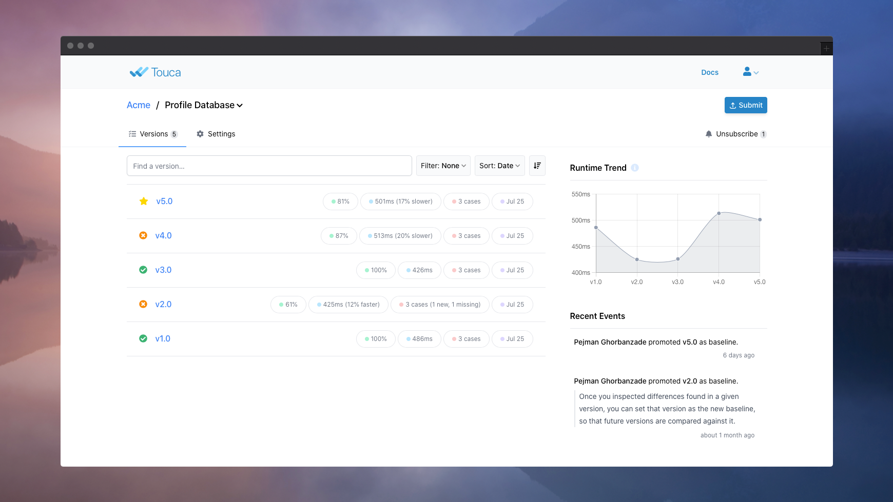

# Manage Notifications

## Suite Subscriptions

You can use the "subscribe" button at the top-right corner of the suite page to
subscribe to any given suite to be notified about the status of its future
versions.

By default, only the team member who originally created the Suite is subscribed
to it.

## Email Notifications

When all the test results are submitted for a new version of the a given suite,
the server automatically sends a summary report of the comparison results for
that version to the team members who are subscribed to the suite.

If there are potential differences the email would contain a summary of those
differences found between the new version and the baseline version of our suite.
We can always click on "View Results" to inspect the differences on the Touca
server, in more detail.

The server can also notify us when a member of our team promotes a given version
of our workflow as the new baseline of our suite.

