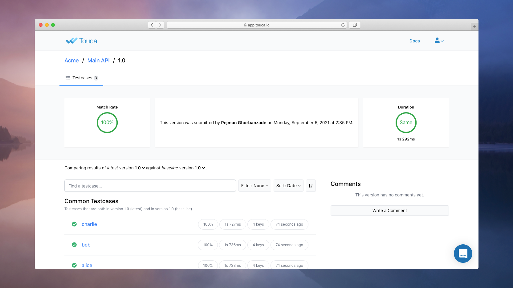
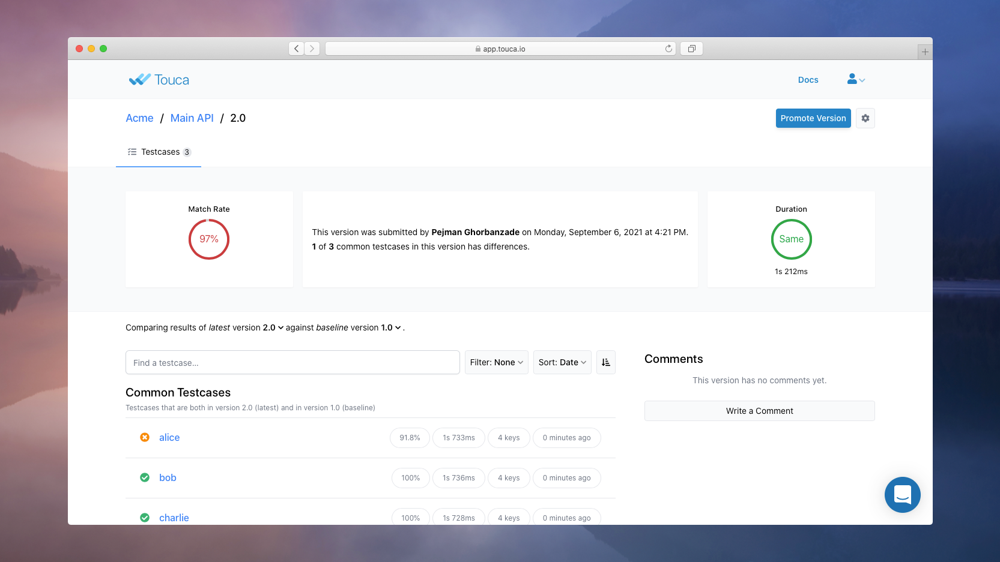
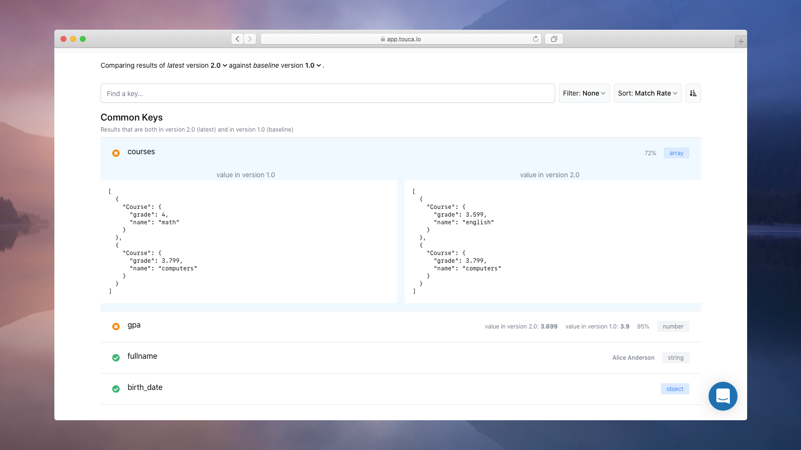

# Interpret Results

In the previous document, we learned how to write a simple Touca test and run it
to submit data for the _current_ version of our software workflow.


We can inspect the test results submitted for each test case in this version:



We can also review the captured data for any one of the test cases.


But submitting results to a remote Touca server makes more sense when we have
large amounts of data that is difficult to compare across versions and
overwhelming to interpret manually. Touca server automatically compares
submitted test results against previous versions and visualizes all differences
to make it easy for us to trace those differences back to their root cause.

In this document, we will learn how Touca server can help us detect differences
in future versions of our software, inspect those differences to determine
whether they are intended, and take action based on our investigation.

## Changing the Code

We are going to keep using the same "Parse Profile" software as in the previous
document. Let us start with making a small change to our code under test.





While we can make any changes to our code under test, for now we are going to
replicate a change in behavior by changing one of Alice's courses from
`Course("math", 4.0)` to `Course("english", 3.6)`.

Once we rebuild our software and its corresponding test tool, we can run our
test again, this time for version 2.0 of our code.

```bash
python ./students_test.py --revision 2.0
```





If you are using the Docker image provided in the
[examples repository](https://github.com/trytouca/examples), you have sudo
privileges to install your preferred editor, e.g.
`sudo apt update && sudo apt install vim`.

While we can make any changes to our code under test, for now we are going to
replicate a change in behavior by changing one of Alice's courses from
`Course {"math", 4.0}` to `Course {"english", 3.6}`.

Once we rebuild our software and its corresponding test tool, we can run our
test again, this time for version 2.0 of our code.

```bash
./build.sh
sudo cmake --install local/build
example_cpp_main_api --revision 2.0
```





While we can make any changes to our code under test, for now we are going to
replicate a change in behavior by changing one of Alice's courses from
`{ name: 'math', grade: 4.0 }` to `{ name: 'english', grade: 3.6 }`.

Once we rebuild our software and its corresponding test tool, we can run our
test again, this time for version 2.0 of our code.

```bash
yarn build
node ./students_test.js --revision 2.0
```





Notice that we are not specifying the list of test cases anymore. When they are
not explicitly provided, the SDK fetches this list from the Touca server.

```text
Touca Test Framework
Suite: main-api
Revision: 2.0

 (  1 of 3  ) alice                            (pass, 233 ms)
 (  2 of 3  ) bob                              (pass, 236 ms)
 (  3 of 3  ) charlie                          (pass, 228 ms)

Processed 3 of 3 testcases
Test completed in 1223 ms
```

As test cases are executed, Touca server compares their captured test results
and performance benchmarks against the pervious version `v1.0` and visualizes
the differences.



We can inspect the differences reported for test case `alice` to understand the
impact of our recent code change.


