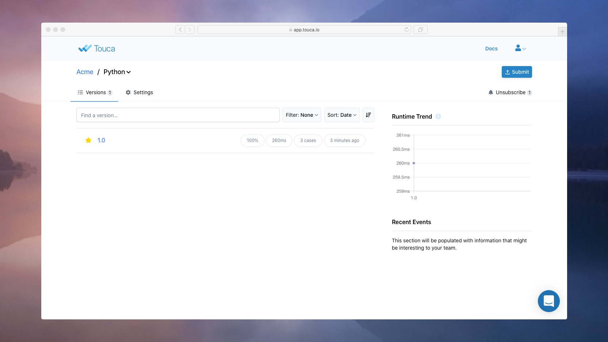
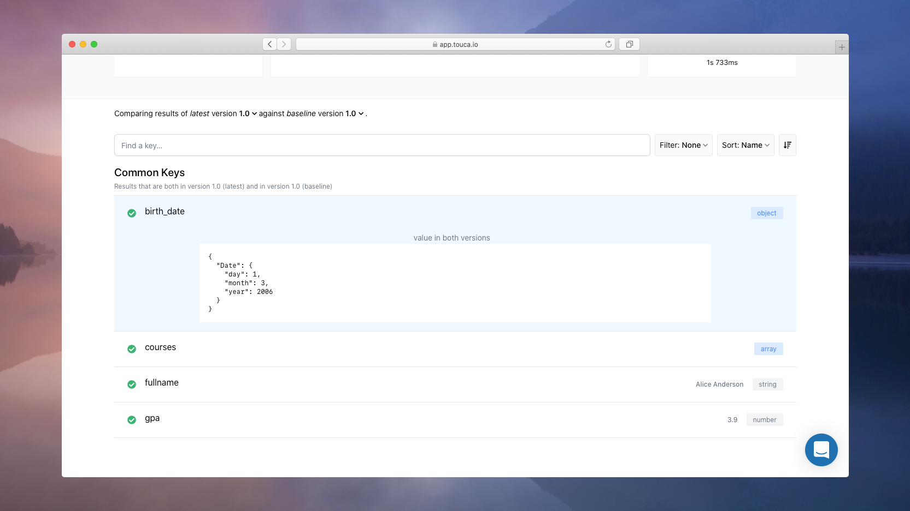
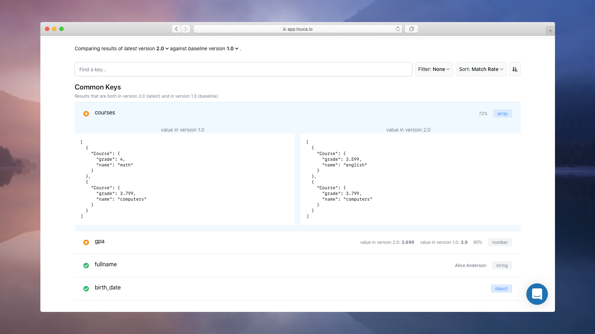
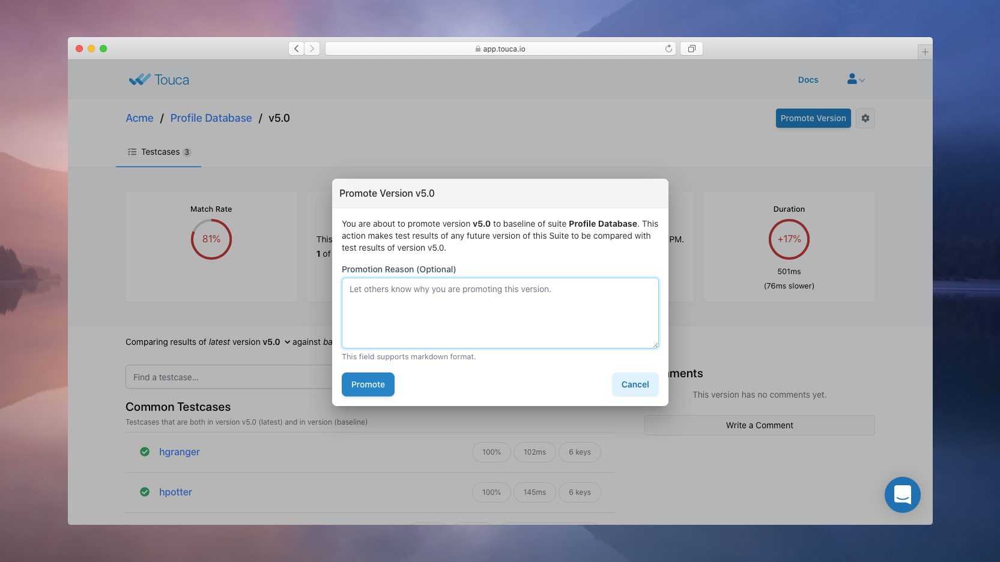

# Interpret Results

In the previous document, we learned how to write a simple Touca test and run it
to submit data for the _current_ version of our software workflow.



This page provides an overview of how our workflow changes over time in behavior
and performance. We can click on each version to inspect the test results
submitted for each test case in that version.


We can also review the captured data for any one of the test cases.



But submitting results to a remote Touca server makes more sense when we have
large amounts of data that is difficult to compare across versions and
overwhelming to interpret manually. Touca server automatically compares
submitted test results against previous versions and visualizes all differences
to make it easy for us to trace those differences back to their root cause.

In this document, we will learn how Touca server can help us detect differences
in future versions of our software, inspect those differences to determine
whether they are intended, and take action based on our investigation.

## Changing the Code

We are going to keep using the same "Parse Profile" software as in the previous
document. Let us start with making a small change to our code under test.





While we can make any changes to our code under test, for now we are going to
replicate a change in behavior by changing one of Alice's courses from
`Course("math", 4.0)` to `Course("english", 3.6)`.

Once we rebuild our software and its corresponding test tool, we can run our
test again, this time for version 2.0 of our code.

```bash
python ./students_test.py --revision 2.0
```





If you are using the Docker image provided in the
[examples repository](https://github.com/trytouca/examples), you have sudo
privileges to install your preferred editor, e.g.
`sudo apt update && sudo apt install vim`.

While we can make any changes to our code under test, for now we are going to
replicate a change in behavior by changing one of Alice's courses from
`Course {"math", 4.0}` to `Course {"english", 3.6}`.

Once we rebuild our software and its corresponding test tool, we can run our
test again, this time for version 2.0 of our code.

```bash
./build.sh
sudo cmake --install local/build
example_cpp_main_api --revision 2.0
```





While we can make any changes to our code under test, for now we are going to
replicate a change in behavior by changing one of Alice's courses from
`{ name: 'math', grade: 4.0 }` to `{ name: 'english', grade: 3.6 }`.

Once we rebuild our software and its corresponding test tool, we can run our
test again, this time for version 2.0 of our code.

```bash
yarn build
node ./students_test.js --revision 2.0
```





While we can make any changes to our code under test, for now we are going to
replicate a change in behavior by changing one of Alice's courses from
`Course("math", 4.0)` to `Course("english", 3.6)`.

Once we rebuild our software and its corresponding test tool, we can run our
test again, this time for version 2.0 of our code.

```bash
./gradlew build
gradle runExampleMain --args='--revision 2.0'
```





Notice that we are not specifying the list of test cases anymore. When they are
not explicitly provided, the SDK fetches this list from the Touca server.

```text

Touca Test Framework
Suite: main-api/v2.0

 1.  PASS   alice      (233 ms)
 2.  PASS   bob        (236 ms)
 3.  PASS   charlie    (228 ms)

Tests:      3 passed, 3 total
Time:       1.22 s

✨   Ran all test suites.

```

As test cases are executed, the server compares their captured test results and
performance benchmarks against the pervious "baseline" version `v1.0` and
visualizes the differences.


We can inspect the differences reported for test case `alice` to understand the
impact of our recent code change.



## Promoting Baseline

The main goal of the Touca server is to make it easy for us to find and
understand the side-effects of our code changes. Once we inspect the reported
differences for a given version of our workflow, we can decide whether those
differences match our expectations. If we determine that the differences are
unexpected, we can share the findings of our investigation with our team by
adding comments and collaborate to find the root cause of potential defects.

There are times when we may want to change expected behavior or performance of
our workflow. We can use the Touca server to promote any given version of our
workflow as the new _baseline_, using the "Promote Version" button in the
version overview page.



Promoting a version as "Baseline" makes the Touca server automatically compare
future versions of our workflow against that version. Since this may be an
important event in the course of evolution of our software, we could make a note
to explain our reasons for taking this action. The server shares our explanation
with all team members subscribed to this Suite using their preferred
notification settings(s).

In the next section, we will review some of the Touca server features regarding
event subscription and notification management.
