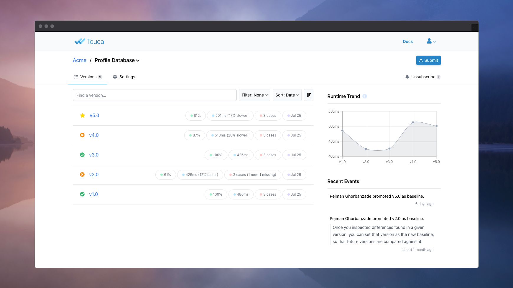

# Quick Start

Welcome! If you are new to Touca, this is the right place to be! Our main
objective here is to introduce Touca without taking too much of your time. We
hope to make you excited enough to check out our hands-on tutorials next.

## Revisiting Unit Testing

Let us imagine that we want to test a software workflow that reports whether a
given number is prime.





```python
def is_prime(number: int):
```





```cpp
bool is_prime(const int number);
```





```typescript
function is_prime(number: number): boolean;
```





```java
public static Student parseProfile(final String username);
```





We can use unit testing in which we hard-code a set of input numbers and list
our expected return value for each input.





```python
from code_under_test import is_prime

def test_is_prime():
    assert is_prime(-1) == False
    assert is_prime(1)  == False
    assert is_prime(2)  == True
    assert is_prime(13) == True
```





```cpp
#include "catch2/catch.hpp"
#include "code_under_test.hpp"

TEST_CASE("is_prime")
{
    CHECK(is_prime(-1) == false);
    CHECK(is_prime(1) == false);
    CHECK(is_prime(2) == true);
    CHECK(is_prime(13) == true);
}
```





```typescript
import { is_prime } from "code_under_test";

test("test is_prime", () => {
  expect(is_prime(-1)).toEqual(false);
  expect(is_prime(1)).toEqual(false);
  expect(is_prime(2)).toEqual(true);
  expect(is_prime(13)).toEqual(true);
});
```





```java
import static org.junit.Assert;

public class PrimeTest {
    public static void main(String[] args) {
        Assert.assertTrue(Prime.isPrime(13));
        Assert.assertTrue(Prime.isPrime(17));
        Assert.assertFalse(Prime.isPrime(51));
    }
}
```





Unit testing is an effective method to gain confidence in the behavior of
functions we are going to implement or have already implemented. But let us, for
a moment, review some of the fundamentals of building and maintaining unit
tests:

- For each input, we need to specify the corresponding expected output, as part
  of our test logic.
- As our software requirements evolve, we may need to go back and change our
  expected outputs.
- When we find other interesting inputs, we may need to go back and include them
  in our set of inputs.

In our example, the input and output of our code under test are a number and a
boolean. If we were testing a video compression algorithm, they may have been
video files. In that case:

- Describing the expected output for a given video file would be difficult.
- When we make changes to our compression algorithm, accurately reflecting those
  changes in our expected values would be time-consuming.
- We would need a large number of input video files to gain confidence that our
  algorithm works correctly.

## Introducing Touca

Touca makes it easier to continuously test workflows of any complexity and with
any number of test cases.





```python
import touca

@touca.Workflow
def is_prime_test(testcase: str):
    touca.add_result("is_prime", is_prime(int(testcase)))

if __name__ == "__main__":
    touca.run()
```





```cpp
#include "touca/touca.hpp"
#include "touca/touca_main.hpp"
#include "code_under_test.hpp"

void touca::main(const std::string& testcase)
{
    const auto number = std::stoul(testcase);
    touca::add_result("is_prime", is_prime(number));
}
```





```typescript
import { touca } from "@touca/node";

touca.workflow("is_prime_test", (testcase: string) => {
  touca.add_result("is_prime", is_prime(Number.parseInt(testcase)));
});

touca.run();
```





```java
import io.touca.Touca;

public final class PrimeTest {
    public static void main(String[] args) {
        Touca.workflow("is_prime_test", (final String testcase) -> {
            final int number = Integer.parseInt(testcase);
            Touca.addResult("is_prime", Prime.isPrime(number));
        });
        Touca.run(args);
    }
}
```





This code needs some explanation. Let us start by reviewing what is missing:

- We have fully decoupled our test inputs from our test logic. We refer to these
  inputs as "test cases". Our open-source SDKs retrieve the test cases from the
  command line, or a file, or a remote Touca server and feed them one by one to
  our code under test.
- We have removed the concept of expected values. With Touca, we only describe
  the actual behavior and performance of our code under test by capturing values
  of interesting variables and runtime of important functions, from anywhere
  within our code. Touca SDKs submit this description to a remote Touca server
  which compares it against the description for a trusted version of our code.
  The server visualizes any differences and reports them in near real-time.

We can run Touca tests with any number of inputs from the command line:





```bash
python3 prime_app_test.py
  --api-key <TOUCA_API_KEY>
  --api-url <TOUCA_API_URL>
  --revision v1.0
  --testcase 13 17 51
```





```bash
./prime_app_test
  --api-key <TOUCA_API_KEY>
  --api-url <TOUCA_API_URL>
  --revision v1.0
  --testcase 13 17 51
```





```bash
node dist/is_prime_test.js
  --api-key <TOUCA_API_KEY>
  --api-url <TOUCA_API_URL>
  --revision v1.0
  --testcase 13 17 51
```





```bash
gradle runExampleMinimal --args='--api-key <TOUCA_API_KEY> --api-url <TOUCA_API_URL> --revision v1.0 --testcase 13 17 51'
```





Where `TOUCA_API_KEY` and `TOUCA_API_URL` can be obtained from the Touca server
at [app.touca.io](https://app.touca.io). This command produces the following
output:

```text
Touca Test Framework
Suite: is_prime_test
Revision: v1.0

 (  1 of 3  ) 13                   (pass, 127 ms)
 (  2 of 3  ) 17                   (pass, 123 ms)
 (  3 of 3  ) 51                   (pass, 159 ms)

Processed 3 of 3 testcases
Test completed in 565 ms
```

If and when we change the implementation of `is_prime`, we can rerun the test
\(passing a different version number\) and submit the results for the new
version to the Touca server. The server takes care of storing and comparing the
results submitted between the two versions and reports the differences in near
real-time.

The Touca server considers the test results submitted for the first version of
our test, as our baseline: all subsequent versions submitted to the server would
be compared against it. If, for any reason, requirements of our software change
and we decide to change this baseline, we can do so by clicking a button right
from the Touca server UI.



## Value Proposition

Touca is very effective in addressing common problems in the following
situations:

- When we need to test our workflow with a large number of inputs.
- When the output of our workflow is too complex, or too difficult to describe
  in our unit tests.
- When interesting information to check for regression is not exposed through
  the interface of our workflow.

The highlighted design features of Touca can help us test these workflows at any
scale.

- Decoupling our test input from our test logic, can help us manage our long
  list of inputs without modifying the test logic. Managing that list on a
  remote server accessible to all members of our team, can help us add notes to
  each test case, explain why they are needed and track how their performance
  changes over time.
- Submitting our test results to a remote server, instead of storing them in
  files, can help us avoid the mundane tasks of managing and processing of those
  results. The Touca server retains test results and makes them accessible to
  all members of the team. It compares test results using their original data
  types and reports discovered differences in real-time to all interested
  members of our team. It allows us to audit how our software evolves over time
  and provides high-level information about our tests.
