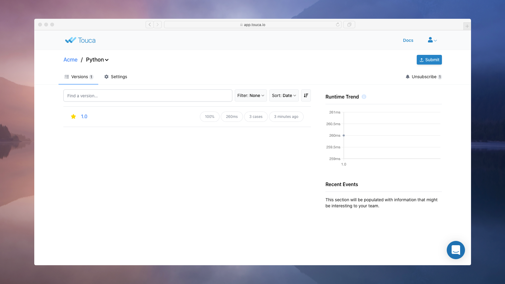

You've made it this far. Great! 👍🏼

We assume you have followed our [Setup Your Account](./account-setup.md)
tutorial to create an account on Touca. In this document, we will show you how
to write and run a simple Touca test to submit your first test results to the
Touca server.


This is a hands-on tutorial. It's only fun if you follow along. 👨🏻‍💻

# Code Under Test

Let us imagine we are building a profile database software that retrieves
personal information of students based on their username.







```python
def parse_profile(username: str) -> Student:
```









```cpp
Student parse_profile(const std::string& username);
```









```typescript
async function parse_profile(username: string): Promise<Student>;
```







Where type `Student` could be defined as follows:







```python
@dataclass
class Student:
    username: str
    fullname: str
    dob: datetime.date
    gpa: float
```









```cpp
struct Student {
    std::string username;
    std::string fullname;
    Date dob;
    float gpa;
};
```









```typescript
interface Student {
  username: string;
  fullname: string;
  dob: Date;
  gpa: number;
}
```







We have created an [examples](https://github.com/trytouca/examples) repository
that includes a possible implementation for this software.


Clone this repository to a directory of your choice.

```bash
git clone git@github.com:trytouca/examples.git
```

Navigate to your local copy of this repository and change your working directory
to the directory for your preferred programming language. We have added several
examples for each language. Each example serves as a standalone hands-on
tutorial that showcases different Touca SDK features.

In this document, we will be using the `02_<lang>_basic_api` example which
includes two modules `students` and `students_test`. The `students` module
represents our code under test: the production code for our _profile database_
software. Our code under test can have any complexity. It may call various
nested functions, connect to database, and scrape the web to return information
about a student given their username.

Check out the `students` module for a possible "current" implementation:







```python
def parse_profile(username: str) -> Student:
    sleep(0.2)
    data = next((k for k in students if k[0] == username), None)
    if not data:
        raise ValueError(f"no student found for username: ${username}")
    return Student(data[0], data[1], data[2], calculate_gpa(data[3]))
```









```cpp
Student parse_profile(const std::string& username)
{
  std::this_thread::sleep_for(std::chrono::milliseconds(200));
  if (!students.count(username)) {
      throw std::invalid_argument("no student found for username: " + username);
  }
  const auto& student = students.at(username);
  return {
      student.username,
      student.fullname,
      student.dob,
      calculate_gpa(student.courses)
  };
}
```









```typescript
export async function parse_profile(username: string): Promise<Student> {
  await new Promise((v) => setTimeout(v, 200));
  const data = students.find((v) => v.username === username);
  if (!data) {
    throw new Error(`no student found for username: ${username}`);
  }
  const { courses, ...student } = data;
  return { ...student, gpa: calculate_gpa(courses) };
}
```







# Writing a Touca Test

With Touca, we call our workflow under test with various inputs and try to
describe the behavior and performance of our implementation by capturing values
of variables and runtime of functions as results and metrics. While this is
similar to unit testing, there are fundamental differences:

- Instead of hard-coding inputs to our code under test, we pass them via the
  `testcase` parameter to our Touca test workflow.
- Instead of hard-coding expected outputs for each test case, we use Touca data
  capturing functions to record the _actual_ values of important variables.
- Instead of being bound to checking the output value of our code under test, we
  can track value of any variable and runtime of any function in our code under
  test.

These differences in approach stem from a difference in objective. Unlike unit
testing, our goal is **not** to verify that our code behaves _correctly_. We
want to check that it behaves and performs _as well as before_. This way, we can
start changing our implementation without causing regressions in our overall
software.

Here is a possible implementation for our first Touca test code:







```python
import touca
from students import parse_profile

@touca.Workflow
def students_test(username: str):
    student = parse_profile(username)
    touca.add_assertion("username", student.username)
    touca.add_result("fullname", student.fullname)
    touca.add_result("birth_date", student.dob)
    touca.add_result("gpa", student.gpa)

if __name__ == "__main__":
    touca.run()
```









```cpp
#include "students.hpp"
#include "students_types.hpp"
#include "touca/touca_main.hpp"

void touca::main(const std::string& username)
{
    const auto& student = parse_profile(username);
    touca::add_assertion("username", student.username);
    touca::add_result("fullname", student.fullname);
    touca::add_result("birth_date", student.dob);
    touca::add_result("gpa", student.gpa);
}
```









```typescript
import { touca } from "@touca/node";
import { parse_profile } from "./students";

touca.workflow("students_test", async (username: string) => {
  const student = await parse_profile(username);
  touca.add_assertion("username", student.username);
  touca.add_result("fullname", student.fullname);
  touca.add_result("birth_date", student.dob);
  touca.add_result("gpa", student.gpa);
});

touca.run();
```







Notice the absence of hard-coded inputs and expected outputs. Each Touca
workflow, takes a short, unique, and URL-friendly testcase name, maps that to a
corresponding input and passes that input to our code under test. In the above
code snippet, once we receive the output of our `parse_profile` workflow, we use
`add_result` to track various characteristics of that output. Touca notifies us
if these characteristics change in a future version of our `parse_profile`
workflow.

We can track any number of variables in each Touca test workflow. More
importantly, we can track important variables that might not necessarily be
exposed through the interface of our code under test. In our example, our
software computes the GPA of a student based on their courses and using an
internal function `calculate_gpa`. With Touca, we can check this function for
regression by tracking both the calculated GPA and the list courses, without
creating a separate test workflow.







```python
def calculate_gpa(courses: List[Course]):
    touca.add_result("courses", courses)
    return sum(k.grade for k in courses) / len(courses) if courses else 0
```









```cpp
float calculate_gpa(const std::vector<Course>& courses)
{
    touca::add_result("courses", courses);
    const auto& sum = std::accumulate(courses.begin(), courses.end(), 0.0f,
        [](const float sum, const Course& course) {
            return sum + course.grade;
        });
    return courses.empty() ? 0.0f : sum / courses.size();
}
```









```typescript
function calculate_gpa(courses: Course[]): number {
  touca.add_result("courses", courses);
  return courses.length
    ? courses.reduce((sum, v) => sum + v.grade, 0) / courses.length
    : 0.0;
}
```







Notice that we are using Touca `add_result` inside our production code. Touca
data capturing functions are no-op in the production environment. When they are
executed by Touca workflow in a test environment, they start capturing values
and associating them with the active test case.

Lastly, Touca helps us track changes in the performance of different parts of
our code, for any number of test cases. While there are various patterns and
facilities for capturing performance benchmarks, the most basic functions are
`start_timer` and `stop_timer` for measuring runtime of a given piece of code,
as shown below.







```python
import touca
from students import parse_profile

@touca.Workflow
def students_test(username: str):
    touca.start_timer("parse_profile")
    student = parse_profile(username)
    touca.stop_timer("parse_profile")
    touca.add_assertion("username", student.username)
    touca.add_result("fullname", student.fullname)
    touca.add_result("birth_date", student.dob)
    touca.add_result("gpa", student.gpa)
    touca.add_metric("external_source", 1500)

if __name__ == "__main__":
    touca.run()
```









```cpp
#include "students.hpp"
#include "students_types.hpp"
#include "touca/touca_main.hpp"

void touca::main(const std::string& username)
{
    const auto& student = parse_profile(username);
    touca::add_assertion("username", student.username);
    touca::add_result("fullname", student.fullname);
    touca::add_result("birth_date", student.dob);
    touca::add_result("gpa", student.gpa);
    touca::add_metric("external_source", 1500);
}
```









```typescript
import { touca } from "@touca/node";
import { parse_profile } from "./students";

touca.workflow("students_test", async (username: string) => {
  touca.start_timer("parse_profile");
  const student = await parse_profile(username);
  touca.stop_timer("parse_profile");
  touca.add_assertion("username", student.username);
  touca.add_result("fullname", student.fullname);
  touca.add_result("birth_date", student.dob);
  touca.add_result("gpa", student.gpa);
  touca.add_metric("external_source", 1500);
});

touca.run();
```







There is so much more that we can cover, but for now, let us accept the above
code snippet as the first version of our Touca test code and proceed with
running this test.

# Running a Touca Test

Let us now use one of Touca SDKs to write a test that could help us detect
future changes in the overall behavior or performance of our profile database
software.





Navigate to directory `python/02_python_basic_api` in the `examples` repository
and create a virtual environment using Python v3.6 or newer.



```bash
python -m venv .env
source .env/bin/activate
```



Install Touca SDK as a third-party dependency:



```bash
pip install touca
```







Navigate to directory `cpp/02_cpp_basic_api` in the `examples` repository and
run `build.sh` or `build.bat` depending on your platform using CMake 3.14 or
newer. This command produces executables in a `./local/dist/bin` directory.



```bash
./build.sh
```



This example uses CMake's `FetchContent` to pull Touca SDK as a dependency. See
our SDK documentation for instructions to use Conan, instead.







Navigate to directory `javascript/02_node_basic_api` in the `examples`
repository and use either of `yarn` or `npm` to build examples using Node v12 or
newer.



```bash
npm install
npm build
```







We can run Touca test from the command line, passing the following information
as command line arguments.

- API Key: to authenticate with the Touca server
- API URL: to specify where test results should be submitted to
- Revision: to specify the version of our code under test
- Testcases: to specify what inputs should be given to our workflow under test

We can find API Key and API URL on the Touca server. We can use any string value
for _Revision_. More importantly, we can pass any number of test cases to the
code under test, without ever changing our test logic.







```bash
python3 prime_app_test.py
  --api-key <TOUCA_API_KEY>
  --api-url <TOUCA_API_URL>
  --revision v1.0
```









```bash
./prime_app_test
  --api-key <TOUCA_API_KEY>
  --api-url <TOUCA_API_URL>
  --revision v1.0
```









```bash
node dist/is_prime_test.js
  --api-key <TOUCA_API_KEY>
  --api-url <TOUCA_API_URL>
  --revision v1.0
```







In real-world scenarios, we may have too many test cases to specify as command
line arguments. We can write our test cases to a file and pass the path to that
file using the `--testcase-file` option. Alternatively, we can add our test
cases directly to the Touca server. When test cases are not provided via
`--testcase` or `--testcase-file` options, Touca SDKs attempt to retrieve them
from the Touca server.

The above command produces the following output.

```text
Touca Test Framework
Suite: is_prime_test
Revision: v1.0

 (  1 of 3  ) 13                   (pass, 127 ms)
 (  2 of 3  ) 17                   (pass, 123 ms)
 (  3 of 3  ) 51                   (pass, 159 ms)

Processed 3 of 3 testcases
Test completed in 565 ms
```

At this point, we should see the results of our test on the Touca server. This
is a big milestone. Congratulations! 🎉



Notice that this version is shown with a star icon to indicate that it is the
baseline version of our Suite. Touca will compare subsequent versions of our
software against the test results submitted for this version.

In the next section, we will see how to use Touca to understand the differences
between different versions of our software, investigate their root cause,
communicate our findings with our team members, and update the baseline version.
