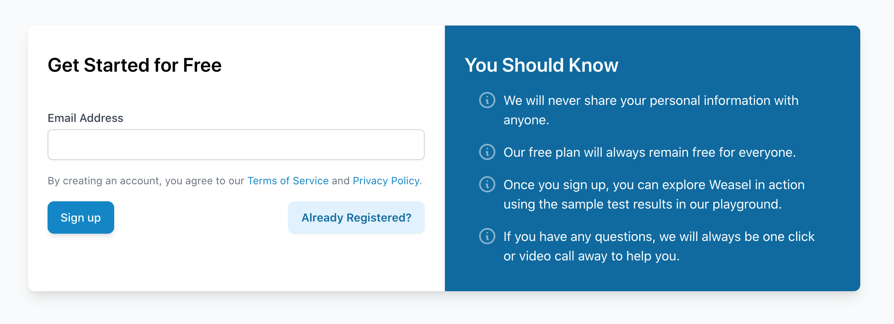
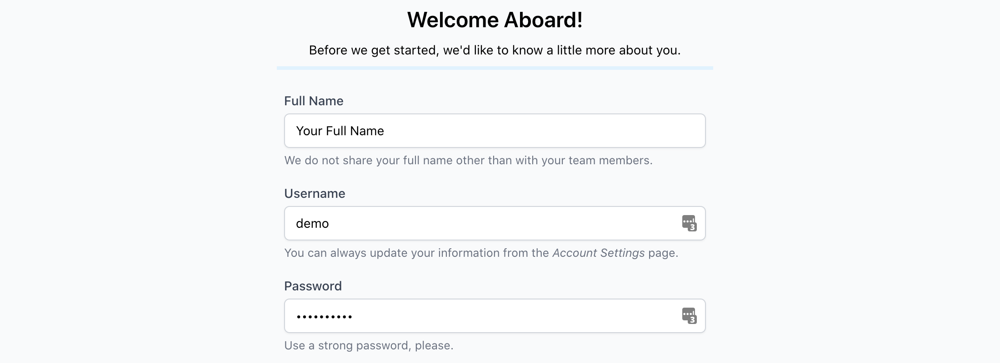
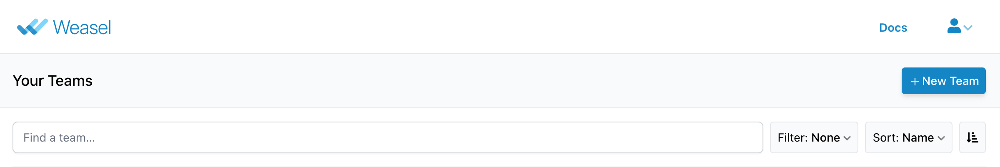
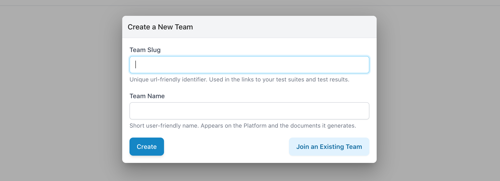
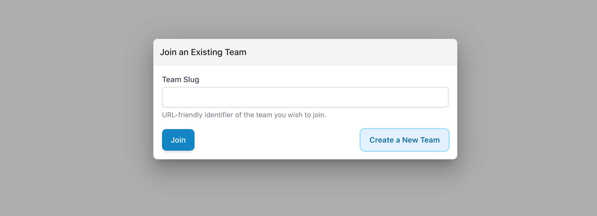
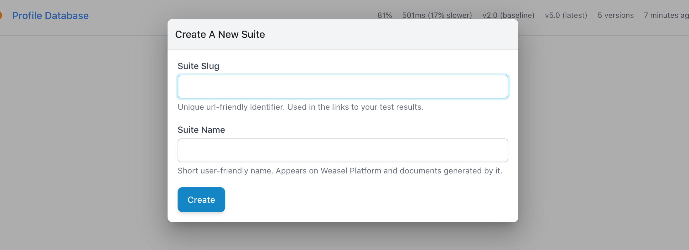

# Setup Your Account

## Create an Account

If you have not done so already, go ahead and create an account through our [Get Started](https://getweasel.com/account/signup) page.

Once you provide your email address, you will receive a welcome email that includes a link to complete your account registration. After verifying your email address, you can choose a username and password combination that lets you log into your account in the future.

Once you choose your account credentials, your account registration is complete.

You will notice that Touca has automatically created a Team for you and populated them with sample test results that will help you explore Touca in action. If you are self-hosting Touca, your platform administrator may have disabled this feature.

## Create a New Team

We encourage you to explore the sample test results in the "Tutorial" team, but you can create your own team, as well. Each user account on Touca can be a member or the owner of multiple teams. To create a team, simply click on the "New Team" button on the top right corner of the screen.

Creating a team requires choosing a "slug" and a "name". We recommend that you choose descriptive values for both. You will share them with those you invite to your team. Other users who want to join your team would need to know your team slug to send requests.

* A team slug can be any string no less than 3 and no more than 32 characters in length. It can mix numeric digits and ASCII letters with hyphens in between. `acme-proj-2` is a valid slug.
* A team name can be any string up to 32 characters in length.

## Join an Existing Team

Each team on Touca can have no more than one owner. Therefore, your colleagues might have already created a team that you want to join. The process to join a team is very similar to that of creating a team. Simply click on "Join an Existing Team" button and enter the slug for the team you want to join. This will send a Join Request that the team admins or the team owner can approve or decline.

## Create a Suite

You can create as many suites within a team. Each suite can corresponds to a regression test workflow and can host test results submitted for different versions of that workflow. Similar to a team, creating a Suite requires a slug and a name. The requirements for suite slug and suite name are similar to team slug and team name, respectively. Suites created within a team can be accessed by all members in that team.

You will notice that upon creation of a new suite, the Touca Server provides you with an API Key and an API URL. You can use this information to submit your test results for any given version of your software workflow.

In the next section, we will show you how to create your first regression test tool.

