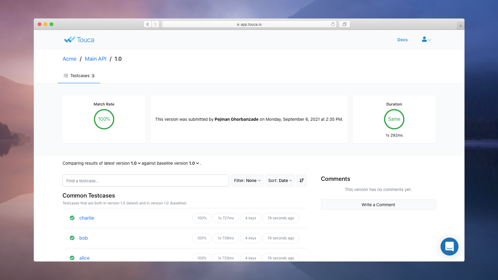
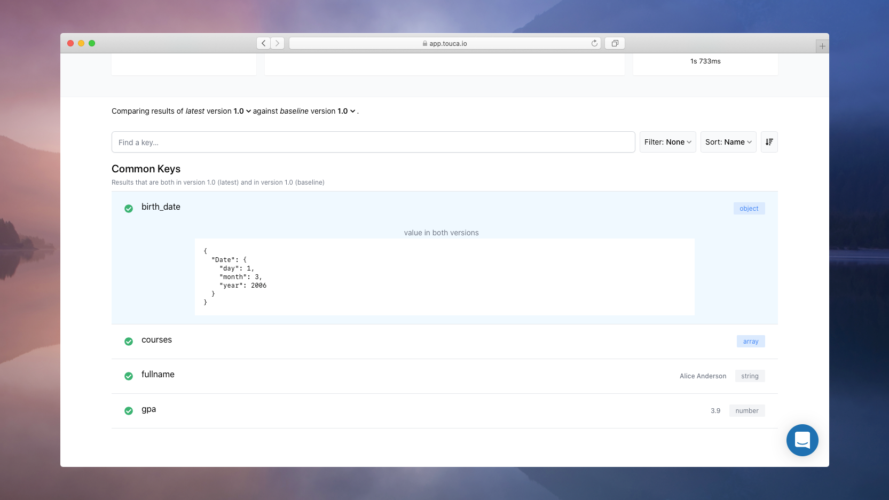

# Main API of JavaScript SDK

[So far](./quickstart.md), we learned how to write and run a simple Touca test
using the Touca SDK for JavaScript. But our previous `is_prime` example was too
minimal to show how Touca can help us describe the behavior and performance of
real-world software workflows. Let us use a Profile Lookup software as another
example that takes the username of a student and returns basic information about
them, such as their name, date of birth, and GPA.

```ts
export async function parse_profile(username: string): Student;
```

where `Student` has the following properties:

```ts
interface Student {
  username: string;
  fullname: string;
  dob: Date;
  gpa: number;
}
```

Here's a Touca test we can write for our code under test:

```ts
import { touca } from "@touca/node";
import { parse_profile } from "./students";

touca.workflow("students_test", async (username: string) => {
  touca.start_timer("parse_profile");
  const student = await parse_profile(username);
  touca.stop_timer("parse_profile");
  touca.add_assertion("username", student.username);
  touca.add_result("fullname", student.fullname);
  touca.add_result("birth_date", student.dob);
  touca.add_result("gpa", student.gpa);
  touca.add_metric("external_source", 1500);
});

touca.run();
```

While we are using the same test framework as before, we are tracking more data
about the behavior and performance of our software using various data capturing
functions. In this tutorial, we will learn how these functions work and how they
can help us detect regressions in future versions of our software.

## Describing Behavior

For any given username, we can call our `parse_profile` function and capture the
properties of its output that are expected to remain the same in future versions
of our software.

We can start small and capture the entire returned object as a Touca result:

```ts
touca.add_result("student", student);
```

Adding the output object as a single entity works. But what if we decided to add
a field to the return value of `parse_profile` that reported whether the profile
was fetched from the cache?

Since this information may change every time we run our tests, we can choose to
capture different fields as separate entities.

```ts
touca.add_assertion("username", student.username);
touca.add_result("fullname", student.fullname);
touca.add_result("birth_date", student.dob);
touca.add_result("gpa", student.gpa);
```

This approach allows Touca to report differences in a more helpful format,
providing analytics for different fields. If we changed our `parse_profile`
implementation to always capitalize student names, we could better visualize the
differences to make sure that only the value associated with key `fullname`
changes across our test cases.

Note that we used Touca function `add_assertion` to track the `username`. Touca
does not visualize the values captured as assertion unless they are different.

We can capture the value of any number of variables, including the ones that are
not exposed by the interface of our code under test. In our example, let us
imagine that our software calculates GPA of students based on their courses.

If we are just relying on the output of our function, it may be difficult to
trace a reported difference in GPA to its root cause. Assuming that the courses
enrolled by a student are not expected to change, we can track them without
redesigning our API:

```ts
function calculate_gpa(courses: Course[]): number {
  touca.add_result("courses", courses);
  return courses.reduce((sum, v) => sum + v.grade, 0) / courses.length;
}
```

Touca data capturing functions remain no-op in production environments. They are
only activated when running in the context of a `touca.workflow` function call.

## Describing Performance

Just as we can capture values of variables to describe the behavior of different
parts of our software, we can capture the runtime of different functions to
describe their performance.

Touca can notify us when future changes to our implementation result in
significantly changes in the measured runtime values.

```ts
touca.start_timer("parse_profile");
const student = parse_profile(username);
touca.stop_timer("parse_profile");
```

The two functions `start_timer` and `stop_timer` provide fine-grained control
for runtime measurement. If they feel too verbose, we can opt to use
`scoped_timer` as an alternatives:

```ts
const student = await touca.scoped_timer("parse_profile", () =>
  parse_profile(username)
);
```

It is also possible to add measurements obtained by other performance
benchmarking tools.

```ts
touca.add_metric("external_source", 150);
```

In addition to these data capturing functions, Touca test framework
automatically tracks the wall-clock runtime of every test case and reports it to
the Touca server.

Like other data capturing functions, we can use Touca performance logging
functions in production code, to track runtime of internal functions for
different test cases. The functions introduced above remain no-op in production
environments.

## Running the Test

Let us now run our Touca test for the first version of our software.

```bash
export TOUCA_API_KEY="8073c34f-a48c-4e69-af9f-405b9943f8cc"
export TOUCA_API_URL="https://api.touca.io/@/tutorial/main-api"
node ./students_test.js --revision v1.0 --testcase alice bob charlie
```

You can use `--help` to learn about available command line options.

```text
Touca Test Framework
Suite: main-api
Revision: 1.0

 (  1 of 3  ) alice                            (pass, 235 ms)
 (  2 of 3  ) bob                              (pass, 236 ms)
 (  3 of 3  ) charlie                          (pass, 227 ms)

Processed 3 of 3 testcases
Test completed in 1263 ms
```

The Touca SDK captures test results and submits them to the Touca server.



Click on any one of the test cases to review the captured data for it.



## Changing the Code

Let us now make a small change to our code under test.

While we can make any changes to our code under test, for now we are going to
replicate a change in behavior by changing one of Alice's courses from
`{ name: 'math', grade: 4.0 }` to `{ name: 'english', grade: 3.6 }`.

Once we rebuild our software and its corresponding test tool, we can run our
test again, this time for version 2.0 of our code.

```bash
yarn build
node ./students_test.js --revision 2.0
```

Notice that we are not specifying the list of test cases anymore. When they are
not explicitly provided, the SDK fetches this list from the Touca server.

```text
Touca Test Framework
Suite: main-api
Revision: 2.0

 (  1 of 3  ) alice                            (pass, 233 ms)
 (  2 of 3  ) bob                              (pass, 236 ms)
 (  3 of 3  ) charlie                          (pass, 228 ms)

Processed 3 of 3 testcases
Test completed in 1223 ms
```

As test cases are executed, Touca server compares their captured test results
and performance benchmarks against the pervious version `v1.0` and visualizes
the differences.


We can inspect the differences reported for test case `alice` to understand the
impact of our recent code change.


